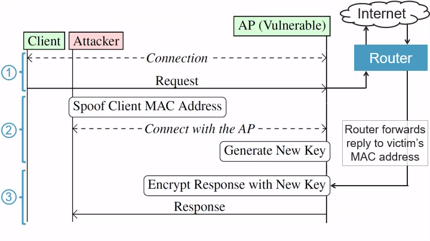

# 
MacStealer: Wi-Fi Client Isolation Bypass

# 1. Introduction

This repo contains MacStealer. It can test Wi-Fi networks for **client isolation bypasses**
**([CVE-2022-47522](#id-assigned-cve)). Our attack can intercept (steal) traffic toward other clients at the MAC layer**,
even if clients are prevented from communicating with each other. This vulnerability affects Wi-Fi
networks with malicious insiders, where our attack can bypass client isolation, which is sometimes
also known as AP isolation. The attack can also be used to bypass Dynamic ARP inspection (DAI),
and can likely also be used to bypass other methods that prevent clients from attacking each other.
The attack is also known as the _security context override attack_, see Section 5 of our
[USENIX Security '23 paper](https://papers.mathyvanhoef.com/usenix2023-wifi.pdf) ([repo](https://github.com/domienschepers/wifi-framing)).

Concrete examples of possible affected networks are:

- Enterprise networks where users may distrust each other, and where techniques such as client isolation
  or ARP inspection are used to prevent users from attacking each other. For instance, company
  networks with accounts for both guests and staff, networks such as eduroam and govroam, etc.

- Public hotspots protected by [Passpoint](https://www.wi-fi.org/discover-wi-fi/passpoint) (formerly Hotspot 2.0).
  These are hotspots that you can automatically and securely connect to. For instance,
  it can seamlessly authenticate you using your phone's SIM card.

- Home WPA2 or WPA3 networks that have client isolation enabled. This includes networks with
  a separate SSID for guests or for insecure (IoT) devices. It also includes networks where
  multiple passwords are used to further isolate devices, which is also known as
  [Multi-PSK](https://www.arubanetworks.com/techdocs/central/2.5.1/content/access-points/cfg/security/wpa2_mpsk.htm),
  [Identity PSK](https://www.cisco.com/c/en/us/td/docs/wireless/controller/technotes/8-5/b_Identity_PSK_Feature_Deployment_Guide.html),
  [per-station PSK](https://0x72326432.com/posts/perstapsk_en/),
  or [EasyPSK](https://www.cisco.com/c/en/us/td/docs/wireless/controller/9800/17-6/config-guide/b_wl_17_6_cg/m_epsk.html).
  See the [threat model discussion](#id-threat-model) for extra info.

- Public hotspots based on [WPA3 SAE-PK](https://www.wi-fi.org/beacon/thomas-derham-nehru-bhandaru/wi-fi-certified-wpa3-december-2020-update-brings-new-0).
  These are hotspots protected by a shared public password, but where an adversary cannot
  abuse this publicly-known password.

We remark that **our attack cannot bypass VLANs**. In other words, based on current experiments,
our attack cannot be used to exploit a device in another VLAN.

The [repository of other results in our USENIX Security '23](https://github.com/domienschepers/wifi-framing) is also available.

# 2. Vulnerability details

The core idea behind the attack is that the manner in which clients are authenticated is unrelated to
how packets are routed to the correct Wi-Fi client. Namely, authentication is done based on passwords,
usernames, 802.1X identities, and/or certificates, but once the client has connected the routing of
packets is done based on MAC addresses. A malicious insider can abuse this to intercept data towards
a Wi-Fi client by **disconnecting a victim and then connecting under the MAC address of the victim**
**(using the credentials of the adversary)**. Any packets that were still underway to the victim,
such website data that the victim was still loading, will now be received by the adversary instead.

More precisely, attack consists of three steps:

	

1. **Letting the victim request data**: The adversary first waits until the victim (client)
   establishes a Wi-Fi connection with the vulnerable Access Point (AP). We assume the victim
   will then send a request to a server on the Internet. For instance, the victim may send a
   HTTP request to the (plaintext) website `example.com`. The goal of the adversary is to
   intercept the response that will be sent by the website.

2. **Connecting under the victim's MAC address**: After the victim requested data, for instance
   by sending a HTTP Request packet, the adversary will forcibly disconnect the victim from the
   network _before_ the response arrives at the
   vulnerable AP. In our example, this means the victim is disconnected before the response from
   `example.com` arrives at the AP. Once the victim is disconnected, the adversary spoofs
   the MAC address of the victim and the adversary will connect to the network using their own
   credentials. This means the adversary is a malicious insider that can connect using their own
   credentials to the network, for instance, using their own username and password in an
   Enterprise Wi-Fi network.

3. **Intercepting the response**: Once the adversary connected under the MAC address of the victim,
   the AP will associate the adversary's newly generated encryption keys with the victim's MAC address.
   As a result, when the response from the server arrives at the Wi-Fi network, or any incoming traffic
   towards the victim in general, the router will forward these incoming packets to the victim's
   MAC address. In our example, this means the response from `example.com` is forwarded by the router
   to the victim's MAC address. However, the adversary is now using this MAC address. This means the
   AP will encrypt the response using the keys of the adversary. In other words, the adversary will
   now recieve any pending traffic that is still underway the victim.

We remark that intercepted traffic may be protected by higher-layer encryption, such as TLS and HTTPS.
Nevertheless, even if higher-layer encryption is being used, our attack still reveals
the IP address that a victim is communicating with. This in turn reveals the websites that a victim
is visiting, which can be sensitive information on its own.

By default, the attack does not intercept traffic _sent by the victim_, but can only intercept
traffic _sent towards the victim_. However, an adversary can attempt subsequent attacks to also
intercept traffic sent by the victim. In particular, by intercepting a DNS reply to the victim,
the adversary can spoof a DNS reply and intercept all IP traffic both sent towards and sent by
victim.

Performing the above attack only makes sense when client isolation is enabled in the target network.
Otherwise, if client isolation is disabled, a malicious insider can just directly attack other
clients using techniques such as [ARP spoofing](https://en.wikipedia.org/wiki/ARP_spoofing) (see the
[client isolation tests](#id-test-isolation)).

The attack is identical against Enterprise WPA1, WPA2 and WPA3 networks. This is because the attack
does not exploit any cryptographic properties of Wi-Fi, but instead abuses how a network determines
to which client packets should be sent, i.e., routed, to.

For extra details on the attack, see the _security context override attack_ (Section 5) in our paper
[Framing Frames: Bypassing Wi-Fi Encryption by Manipulating Transmit Queues](https://papers.mathyvanhoef.com/usenix2023-wifi.pdf).

# 3. Possible mitigations

## 3.1. Preventing MAC address stealing

To mitigate our attack, an AP can temporarily prevent clients from connecting if they are using
a MAC address that was recently connected to the AP. This prevents an adversary from spoofing a
MAC address and intercepting pending or queued frames towards a victim. When it can be guaranteed
that the user behind a MAC address has not changed, the client can be allowed to immediately reconnect.
Note that this check must be done over all APs that are part of the same distribution system, and
more specifically, over all APs that clients can roam between while keeping their current IP address.

To securely recognize recently-connected users, an AP can store a mapping between a client’s MAC
address and their cached security associations (e.g., their cached PMK). A client can be allowed
to immediately (re)connect under a recently-used MAC address by proving that they posses the cached
security association linked to this MAC address, e.g., by connecting using the correct cached PMK.

When using multi-PSK, which is also known as [per-station PSK](https://0x72326432.com/posts/perstapsk_en/)
or [Identity PSK](https://www.cisco.com/c/en/us/td/docs/wireless/controller/technotes/8-5/b_Identity_PSK_Feature_Deployment_Guide.html),
the AP can keep a mapping of recently connected MAC addresses and the (unique) password that they used.
When a client connects, the AP checks whether its MAC address was recently used. If it isn't, or if it
is and the client is using the same password as before, the client can connect as normal. However,
if the same MAC address is used with a different password, the client is forced to wait a predefined
amount of time before being able to successfully connect.

When using SAE-PK to secure hotspots, the only method that we are aware of to securely recognize
that a MAC address is being reused by the same user as before, is by relying on cached security
associations (e.g., the cached PMK linked to the MAC address).

The above defenses assume that, after a certain delay, no more pending packets will arrive for the
victim. To prevent leaks beyond this delay, clients can use end-to-end encryption (such as TLS)
with the services they communicate with.

## 3.2. 802.1X authentication and RADIUS extensions

Another method to securely recognize recently-connected users is based on the EAP identity they
used during 802.1X authentication. An AP can securely [learn the EAP identity from the RADIUS server](https://www.rfc-editor.org/rfc/rfc2865)
that authenticated the client, and can keep a mapping of recently connected MAC addresses
and their corresponding EAP identity. When a client connects, the AP checks whether its MAC address
was recently used. If it isn't, or if it is and the client is using the same EAP identity as before,
the client can connect as normal. However, if the same MAC address is used under a different EAP
identity, the client is forced to wait a predefined amount of time before being able to connect
successfully.

One challenge is that the AP may not always know the 802.1X identity of a client due to privacy
concerns. For instance, this information may only be available at the home AAA server, and the AP
will only receive a Chargeable User Identity from the RADIUS server. This identity does not allow the
AP to recognize two associations of the same device/credentials because its value may constantly
change. The AP does receive the anonymous identity in the EAP-Response/Identity, such as anonymous@realm,
and can rely on that to at least recognize users from different realms.

To prevent users in the same realm from attacking each other, without revealing a client's
identity to the AP, cooperation and changes to the RADIUS server are needed. In particular,
the RADIUS server can be updated to help detect if the MAC address was recently being used by
another user in the same realm (in the given local network). The RADIUS server would then need
to be informed when a client disconnects, so it knows when a MAC address was last being used by
one of its users, and needs to be informed of the MAC address of any client that is trying to connect.

## 3.3. Protecting the gateway's MAC address

Important to note is that our attack is not limited to intercepting packets going to
Wi-Fi clients. An adversary could also try to associate with a MAC address of a default
gateway or another server in the local network. To prevent such attacks, the AP or
controller can prohibit clients from using a MAC address equal to the default gateway.
More generally, duplicate MAC address detection can be used when a Wi-Fi client is
connecting to the network, to prevent Wi-Fi clients from using a MAC address that is
also in use by other devices in the network.

## 3.4. Management Frame Protection (802.11w)

Using Management Frame Protection (MFP) would make the attack harder but not impossible.
[In previous work](https://papers.mathyvanhoef.com/wisec2022.pdf), we found some ways
that clients can be disconnected/deauthenticated even when MFP is being used. Based on that
experience, there always appears to be some method to forcibly disconnect a client from the
network, even when MFP is being used. Put differently, it's hard to completely prevent
disconnection and deauthentication attacks. That being said, MFP would be extra hurdle to
overcome when performing the attack in practice, so it can be useful mitigation to make the
attack harder (but not impossible) in practice.

## 3.5. Usage of VLANs

Based on preliminary experiments, the attack does not work across different VLANs. In other
words, the malicious insider that performs the attack must be in the same VLAN as the victim.
One mitigation is therefore to put different groups of users in different VLANs. However,
a malicious insider would still be able to perform the attack (i.e., bypass client isolation)
against other users in the same VLAN.

Note that when using multi-PSK (a.ka. per-station PSK or identity PSK), you can put clients
in different VLANs depending on the password that they use. In other words, you can use a VLAN
for each password. This prevents clients with different passwords from attacking each other.

# 4. Tool Prerequisites

The MacStealer tool works with any network card that is supported by Linux. We tested
MacStealer on Ubuntu 22.04. To install the required dependencies on Ubuntu 22.04 execute:

	sudo apt update
	sudo apt install libnl-3-dev libnl-genl-3-dev libnl-route-3-dev libssl-dev \
		libdbus-1-dev git pkg-config build-essential net-tools python3-venv \
		aircrack-ng rfkill

Now clone this repository, build the tools, and configure a virtual python3 environment:

	git clone https://github.com/vanhoefm/macstealer.git macstealer
	cd macstealer/research
	./build.sh
	./pysetup.sh

The above instructions only have to be executed once.

After pulling in new code using git you do have to execute `./build.sh` and `./pysetup.sh` again.
See the [change log](#id-change-log) for a detailed overview of updates to the MacStealer
since the coordinated disclosure started.

# 5. Before every usage

## 5.1 Execution environment

Every time you want to use MacStealer, you first have to load the virtual python3 environment
as root. This can be done using:

	cd research
	sudo su
	source venv/bin/activate

You should now [disable Wi-Fi in your network manager](https://github.com/vanhoefm/libwifi/blob/master/docs/linux_tutorial.md#id-disable-wifi)
so it will not interfere with MacStealer. Optionally check using `sudo airmon-ng check` to see
which other processes might be using the wireless network card and might interfere with MacStealer.

## 5.2. Network configuration

The next step is to edit [`client.conf`](research/client.conf) with the information of the network that you want to test.
This is a configuration for [`wpa_supplicant`](https://wiki.archlinux.org/title/wpa_supplicant#Connecting_with_wpa_passphrase)
that must contain two network blocks: one representing the victim and one representing
the attacker. An example configuration file to test the fictitious network `kuleuven` is:

	# Don't change this line, other MacStealer won't work
	ctrl_interface=wpaspy_ctrl

	network={
		# Don't change this field, the script relies on it
		id_str="victim"

		# Network to test: fill in properties of the network to test
		ssid="kuleuven"
		key_mgmt=WPA-EAP
		eap=PEAP
		phase2="auth=MSCHAPV2"

		# Victim login: fill in login credentials representing the victim
		identity="the.professor@kuleuven.be"
		password="SuperSecret"
	}

	network={
		# Don't change this field, the script relies on it
		id_str="attacker"

		# Network to test: you can copy this from the previous block
		ssid="kuleuven"
		key_mgmt=WPA-EAP
		eap=PEAP
		phase2="auth=MSCHAPV2"

		# Attacker login: fill in login credentials representing the attacker
		identity="some.student@student.kuleuven.be"
		password="SomePassword"
	}

In the part "network to test" you must provide the name of the network being tested and its
security configuration. See [wpa_supplicant.conf](wpa_supplicant/wpa_supplicant.conf) for
documentation on to write/edit configuration files and for example network blocks for various
types of Wi-Fi networks. In the first network block, under "victim login", you must specify
valid login credentials that represents the simulated victim. In the second network block,
you can provide exactly the same information under "network to test", but you must provide
login credentials that represent the simulated attacker.

In the above example, MacStealer will test an attack where the adverary is `some.student@student.kuleuven.be`
and this adversary will try to intercept traffic sent towards the victim `the.professor@kuleuven.be`.

By default the script uses the configuration file `client.conf`. You can use a different
configuration file by providing the `--config network.conf` paramater, where you can replace
`network.conf` with the configuration file that you want to use.

This repository also contains the following example configuration files:

- [`multipsk.conf`](research/multipsk.conf): A configuration file to test a network that
  uses multi-PSK where one password is used by trusted devices and a second password is
  given to guests.

- [`saepk.conf`](research/saepk.conf): A configuration file to test a public hotspot that
  uses SAE-PK.

Note that it is also possible to edit the network block(s) to test a [specific AP/BSS](#id-test-bss).

## 5.3. Server configuration

By default, MacStealer will send a TCP SYN packet to `8.8.8.8` at port 443 in all tests, which is a
DNS server of Google. If you want to use a different server or port, you can provide one using
the `--server` parameter. For instance:

	./macstealer.py wlan0 --server 208.67.222.222

You can also add the port that must be used in the TCP SYN packets:

	./macstealer.py wlan0 --server 208.67.222.222:80

Replace `wlan0` with the name of your Wi-Fi interface and the IP address with the server
that you want to use.
**This server must retransmit TCP SYN/ACK replies and should, ideally, still send a retransmitted**
**SYN/ACK more than 10 seconds after MacStealer transmitted the initial TCP SYN.** You can
test this retransmission behaviour using the `--ping` parameter as follows:

	./macstealer.py wlan0 --server 208.67.222.222 --ping

MacStealer will output the following in case the server has the required retransmission
behaviour:

	[22:53:15] Received SYN/ACK 15.265095233917236 seconds after sending SYN.
	[22:53:20] >>> Ping test done, everything looks good so far. You can continue with other tests.

In case the provided server doesn't send TCP SYN/ACK replies, or doesn't retransmit them
sufficiently late, MacStealer will output the following:

	[22:52:05] Received SYN/ACK 1.0727121829986572 seconds after sending SYN.
	[22:52:24] >>> Ping test done. Consider using a server that retransmits SYN/ACK for a longer time.

The reason why the server must still retransmit a SYN/ACK after more than 10 seconds, is because
it can sometimes take several seconds to reconnect as the simulated attacker. This reconnection
process must complete before the server sends the last retransmitted TCP SYN/ACK packet.

# 6. Testing for Vulnerabilities

The following table contains common commands that you will execute when testing a network
along with a short description of what each command does. Below the table the details behind
each command are explained.

If the network being tested uses Management Frame Protection (802.11w), the tool assumes
that the adversary can still forcibly disconnect the victim from the network. This assumption
is based on [recent research](https://papers.mathyvanhoef.com/wisec2022.pdf) that showed that
disconnections attacks are typically still possible, albeit less straightforward or general,
when using MFP.

|                  Command                  | Short description
| ----------------------------------------- | ---------------------------------
| 
*[Sanity checks](#id-test-sanity)*

| `./macstealer.py wlan0 --ping`            | Connect as victim & test server's retransmission behavior.
| `./macstealer.py wlan0 --ping --flip`     | Connect as attacker & test server's retransmission behavior.
| 
*[Vulnerability tests](#id-test-vulnerability)*

| `./macstealer.py wlan0`                   | Test the default variant of the MAC address stealing attack.
| `./macstealer.py wlan0 --other-bss`       | Let the attacker connect with a different AP than the victim.
| 
*[Client isolation: Ethernet layer](#id-test-isolation)*

| `./macstealer.py wlan0 --c2c wlan1` | Test client-to-client Ethernet layer traffic (ARP poisoning).
| `./macstealer.py wlan0 --c2c-eth wlan1`| Test client-to-client Ethernet layer traffic (DNS).

## 6.1. Sanity checks

Before testing for vulnerabilities, you can use the following to commands to confirm
that MacStealer can connect to the network as both the victim and attacker:

- `./macstealer.py wlan0 --ping`: connects to the network using the credentials of the victim.
  Once connected, a TCP SYN is sent to the server (which is by default `8.8.8.8` and [can be changed](id-server-config)).
  MacStealer will check whether and how many times the SYN/ACK is (re)transmitted. You can use
  this to confirm that the credentials of the victim are correct and to check that the configured
  server is properly retransmitting SYN/ACK replies.

- `./macstealer.py wlan0 --ping --flip`: Same as the above test, but now the script will connect
  using the credentials of the adversary. You can use this to confirm that the credentials of the
  adversary are correct.

## 6.2. Vulnerability tests (CVE-2022-47522)

- `./macstealer.py wlan0`: Test the default variant of the MAC address stealer attack. The attacker
  will reconnect to the same AP/BSS as the victim.

- `./macstealer.py wlan0 --other-bss`: The attacker will connect to a different AP/BSS of the same
  network. A network that is (also) vulnerable to this test is easier to exploit in practice. If only
  a single AP/BSS is within radio range, the script will timeout when connecting as the attacker.

## 6.3. Client isolation tests (Ethernet layer)

Exploiting the MAC address stealing vulnerability only makes sense if client isolation is enabled
or when techniques such as ARP inspection are used to prevent clients from attacking each other.
Otherwise, an adversary can use easier attacks such as [ARP poisoning](https://en.wikipedia.org/wiki/ARP_spoofing)
to intercept traffic. To test whether client isolation is enabled, or whether ARP inspection is
used by the network, you can use the following commands:

- `./macstealer.py wlan0 --c2c wlan1`: With these arguments, MacStealer tests whether the network
  allows client-to-client ARP poisoning traffic from the attacker (`wlan1`) towards the victim (`wlan0`).
  Here `wlan1` is a second wireless network interface. The script will then test whether malicious
  ARP packets can be sent from the attacker to the victim.

- `./macstealer.py wlan0 --c2c-eth wlan1`: This is similar to the above test, but instead of sending
  malicious ARP packets, the attacker will send DNS packets to the victim.

The MAC address stealing vulnerability should be considered a risk in practice if client-to-client
traffic is blocked in any of the above two tests (meaning when client isolation is enabled or when
other techniques such as ARP inspection are used to prevent users from attacker each other).

By default, MacStealer will try to connect to the same AP/BSS using both interface, so it's
important that both network cards can see the same networks (i.e. make sure that both network
interfaces support the same frequency bands and channels). If you want both clients to connect
to a different AP/BSS then you can use the parameter `--other-bss`.

You can use the `--flip-id` parameter to test whether traffic from the victim (`wlan0`) is allowed
towards the attacker (`wlan1`).

## 6.4. Troubleshooting checklist

In case MacStealer doesn't appear to be working, check the following:

1. Check that no other process is using the network card (e.g. kill your network manager).
   You may see the output `kernel reports: match already configured` if another process
   is also using the network card.

2. If everything worked previously, try unplugging your Wi-Fi dongle, restart your computer or virtual
   machine, and then try again.

3. Confirm that you are connecting to the correct network. Double-check `client.conf`.

4. If you updated the code using git, execute `./build.sh` and `./pysetup.sh` again (see [Prerequisites](#id-prerequisites)).

5. If you are using a virtual machine, try to run MacStealer from a native Linux installation instead.

6. Run MacStealer with the extra parameter `-dd` to get extra debug output from wpa_supplicant
   and from MacStealer itself.

# 7. Advanced Usage

## 7.1. Testing IP layer client isolation

The default [client isolation tests](id-test-isolation) will check whether traffic at the Ethernet
layer is allowed between clients. It is also possible to test whether IP layer traffic is allowed
between clients using the following command:

	./macstealer.py wlan0 --c2c-ip wlan1 [--flip-id]

When IP layer traffic between clients is allowed, it still possible for clients to attack each other.
For instance, [ICMP redirect attacks](https://www.usenix.org/conference/usenixsecurity22/presentation/feng)
may then still be possible. Such attacks are more cumbersome than ARP spoofing, but are ideally
still prevented by also blocking IP layer traffic between clients.

# 7.2. Testing general network properties

The following tests can be executed to test general properties of a network. These tests aren't
directly related to vulnerabilities but can be used to better understand the behaviour of a network.

- `./macstealer.py wlan0 --same-id [--other-bss] [--flip]`: Test whether TCP connections stay alive after
  disconnecting and reconnecting to an Access Points. If connections do not stay alive after reconnecting,
  the network is likely not vulnerable to the MAC address stealing attacks. However, a major downside
  of this behaviour is that legitimate clients have to open new TCP connections whenever reconnecting
  to this network, making this network appear slow and unreliable (so a better defense should be used
  instead).

  You can use the `--other-bss` parameter to reconnect to a different AP/BSS of the same network.
  You can use the `--flip` argument to perform this test under the attacker identity instead
  of the victim identity.

- `./macstealer.py wlan0 --flip`: Test the normal MAC address stealing attack, but switch the
  role of the attacker and victim. In other words, the attacker will use the "victim credentials"
  provided in the configuration file, and the victim will use the "adversary credentials".

- `./macstealer.py wlan0 --c2c wlan1 --same-id [--flid-id]`: Test whether client-to-client traffic is
  allowed between two devices of the same user. See [client isolation tests](#id-test-isolation) for
  documentation on the `wlan1` parameter.

  You can use the `--flip` argument to perform this test under the attacker identity instead
  of the victim identity.

## 7.3. Other parameters

- `--delay seconds`: You can use the parameter `--delay` to specify a delay, in seconds, before reconnecting as
                     the attacker.

- `-d` or `-dd`: Adding one of these parameters increases the debug verbosity of the script
                 and the underlying `wpa_supplicant` instance.

## 7.4. Testing a specific Access Point / BSS

By default, MacStealer will automatically select an AP/BSS of the network to connect with and test.
In case you have a network with multiple APs/BSSes, you can test a specific one by specifying this
AP/BSS in the network block of the victim using the `bssid` keyword. For example, you can use:

	...

	network={
		# Don't change this field, the script relies on it
		id_str="victim"

		# Network to test: fill in properties of the network to test
		ssid="kuleuven"
		key_mgmt=WPA-EAP
		eap=PEAP
		phase2="auth=MSCHAPV2"

		# Victim login: fill in login credentials representing the victim
		identity="the.professor@kuleuven.be"
		password="SuperSecret"

		# This a specific AP/BSS
		bssid=00:11:22:33:44:55
	}

	...

With the above configuration, MacStealer will test `00:11:22:33:44:55`. This means it will
connect both as the victim _and as the attacker_ to this AP.

You can also combine this with the `--other-bss` parameter. In that case, the victim will
connect to `00:11:22:33:44:55`, and the attacker will connect to a different AP/BSS of the
same network.

Another option is to specify an explicit BSS/AP in the network block of the victim _and_ attacker.

Note that MacStealer will search for at most 30 seconds for the given AP/BSS. If it cannot
find the specified AP/BSS the tool will quit.

## 7.5. Testing an SAE-PK network

You can test an SAE-PK network by using the following configuration file. Notice that for
SAE-PK networks there is no difference in how the victim and attacker authenticate, i.e.,
they both use the same password.

	# Don't change this line, other MacStealer won't work
	ctrl_interface=wpaspy_ctrl

	# WPA3/SAE: support both hunting-and-pecking loop and hash-to-element
	sae_pwe=2

	network={
		# Don't change this field, the script relies on it
		id_str="attacker"

		# Network to test - attacker login
		ssid="test-saepk"
		psk="7iip-ytnz-qa25"
		key_mgmt=SAE
		ieee80211w=2
	}

	network={
		# Don't change this field, the script relies on it
		id_str="victim"

		# Network to test - victim login
		ssid="test-saepk"
		psk="7iip-ytnz-qa25"
		key_mgmt=SAE
		ieee80211w=2
	}

# 8. Threat Model Discussion

## 8.1. WPA-PSK authentication

In practice, client isolation is also used in networks that are secured using a pre-shared password.
For instance, several routers have an option to create a network for guests or insecure (IoT) devices,
where clients in this network are isolated so they cannot attack each other. However, the security
advantage of using client isolation in this scenario can be questioned. Client isolation is supposed
to prevent a malicious insider from attacking others. But if the malicious insider knows the
pre-shared password, they can just create a rogue clone (evil twin), trick victims into connecting to
this malicious copy of the network, and then attack other clients! In other words, **using client**
**isolation in a network secured using a password provides no strong security**, a malicious client
can create a rogue AP to still attack other clients.

That being said, it can be argued that creating a rogue AP can be detected by the network administrator,
meaning client isolation does make attacks harder. Additionally, when a lightweight device is (remotely)
compromised, it may not have the resources to (easily) act as a rogue AP. This makes it harder, but not
impossible, to perform attacks when client isolation is used. Overall, although client isolation provides
no strong security guarantees in a password-protected network, it can be argued that it increases the
practical difficulty of performing attacks.

Our MacStealing attack is easier to perform than creating a rogue AP. All that the malicious insider,
e.g., a lightweight compromised IoT devices, needs to do is spoof a MAC address and (re)connect to the
network. Such an attack is also harder to detect. Based on this observation, our new attack makes the
situation worse, and therefore one can argue that our attack should also be considered relevant in
networks protected using a pre-shared password.

**Conclusion: when using client isolation in a password-protected network, you are making the assumption**
**that a malicious insider will not create a rogue AP. Otherwise, the usage of client isolation is**
**meaningless from a security perspective. The MacStealing attack can be performed without creating a**
**rogue AP and therefore makes attacks easier.**

## 8.2. Common misunderstandings

- The goal of our attack isn't to bypass MAC address deny/allow lists on Access Points. Spoofing MAC
  addresses to bypass MAC address filtering is a different and known attack.

- The goal of our attack isn't to hijack someone's paid connection in Wi-Fi hotspots. For instance,
  some open (or protected) hotspots require the user to pay before being allowed to access the internet.
  Often a paying subscriber is recognized based on their MAC address, and an adversary can spoof a victim's
  MAC address to gain access to the Internet. This is not the purpose of our attack; the goal of MacStealer
  is to bypass client isolation.

- Our attack also affects networks that defend against the Hole 196 vulnerability. For instance,
  [Passpoint](https://www.wi-fi.org/discover-wi-fi/passpoint) (formerly Hotspot 2.0) networks are required
  to prevent the Hole 196 vulnerability, but are still vulnerable to our attack.

- Our attack works in networks that defend against ARP spoofing. It badly-secured Wi-Fi networks, an
  adversary can trivially perform ARP spoofing to intercept a victim's traffic, and our attack is not
  really practical. However, modern networks, which may have malicious insiders, rely on client isolation
  or other methods to prevent machine-in-the-middle attacks. Our attacker bypasses all these modern defenses
  and still enables an adversary to intercept traffic toward a victim.

To summarize, our attack affects Wi-Fi networks where clients are prevented from attacking each other,
enabling an adversary to intercept traffic to another client.

## 8.3. Assigned CVE

Most vendors are using CVE-2022-47522 to refer to the Wi-Fi client isolation bypass vulnerability
that is discussed in this git repository. This vulnerability corresponds to the attack in Section 5 of
[our paper](https://papers.mathyvanhoef.com/usenix2023-wifi.pdf).

Unfortunately, other vendors are also using this CVE to refer to the (strictly speaking unrelated)
vulnerability that is discussed in Section 3 of [our paper](https://papers.mathyvanhoef.com/usenix2023-wifi.pdf).
In fact, the actual description of the CVE as can be found on MITRE, in our opinion, only describes the
attack in Section 3 of our paper. In practice, it seems that CVE-2022-47522 is used to refer to all
attacks in our paper, even though they are technically different.

# 9. Change log

**Version 1.2 (in progress)**

- Improved README: clarified the usage of the CVE identifier.

- Improved README: focus intro on bypassing client isolation, update defenses with 802.1X remarks and
  to prevent stealing the default gateway's MAC address.

- Added the `--delay` parameter to specify a delay in seconds before reconnecting as the attacker.

**Version 1.1 (18 January 2023)**

- By default use `8.8.8.8` as the server instead of `216.58.208.100` (both are Google servers).

- Updated client isolation tests: by default test using ARP poisoning at Ethernet layer. Also provide
  option to send UDP data with forwarding at Ethernet layer, and a test with forwarding at IP layer.

- Improved README: updated the types of network that may be affected. Included a discussion of
  whether password-protected WPA2 or WPA3 networks are affected. Explanation of different commands
  to test for client-to-client Ethernet or IP layer traffic.

- Improved README: discussion of MFP, discussion of VLANs as mitigation, clarify over which APs the
  [identity check](#id-prevent-stealing) must be done, specifying port of the server, 

- Improved output of MacStealer.

**Version 1.0 (3 January 2023)**:

- Prepared initial release for usage during the embargo. The code is based on hostap commit 0f3f9cdcab6a.

